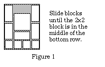

Simple project to solve sliding block puzzles, in particular:

Most of the solver code is copied from my solution to the Streams exercise in 
Coursera "Functional Program Design in Scala".

Comments have not been updated.
